  

  
  
  
  

  <strong>RAAY Creative is open for work: automation, render pipelines, agent systems.</strong> 
  Two people. One builds the pipeline, one signs off the taste. I build the pipeline.

---

### The problem I keep working on

Generative systems fail in a specific, nasty way: they produce output that looks right and is wrong.

A model repaints a product's packaging and the frame is still beautiful. A scraper reports a finished run and returns nothing. A deploy ships the HTML while the content-hashed CSS never lands, so the page is live and broken for an hour before anyone notices. **In every case the naive check — does it look fine? did it say success? — passes.**

So most of what I build is the layer that refuses to trust the output. The gate, the verifier, the ledger that records what was actually measured instead of what was hoped for.

---

  

---

### 🚀 Featured Work

<table>
  <tr>
    <td width="50%" valign="top">
      <h3><a href="https://github.com/abhigyanmahanta/packfix">packfix</a></h3>
      
Verifies that AI-generated product imagery actually preserved the real packaging. SIFT/RANSAC inlier gate, PASS/FAIL per pack per frame — because "looks fine" is not a check. Repairs the frame by homography when the scene is right and the print drifted.

      
<code>Python</code> <code>OpenCV</code> <code>Tested</code>

    </td>
    <td width="50%" valign="top">
      <h3><a href="https://github.com/abhigyanmahanta/raaycreative.com">raaycreative.com</a></h3>
      
The studio site. Next.js on Cloudflare, ~11.5k LOC, 9/9 render tests — and a 540-line deploy verifier written after the live site served for an hour with every stylesheet 404ing behind a 200 response.

      
<code>TypeScript</code> <code>Next.js</code> <code>Live</code>

    </td>
  </tr>
  <tr>
    <td width="50%" valign="top">
      <h3><a href="https://github.com/abhigyanmahanta/precision-video-editor">precision-video-editor</a></h3>
      
Frame-accurate video cutting from a written instruction. The model decides <em>what</em> should happen and never touches a timecode; perception owns every frame number, and resolution is pure lookup.

      
<code>Python</code> <code>ffmpeg</code> <code>Whisper</code>

    </td>
    <td width="50%" valign="top">
      <h3><a href="https://github.com/abhigyanmahanta/hub-pipelines">hub-pipelines</a></h3>
      
Four research pipelines — Instagram, Pinterest, LinkedIn, Reels — sharing one discover → analyze → synthesize → render contract. 12,100 lines. Ships the scrapers and never the scraped corpus.

      
<code>Python</code> <code>Playwright</code>

    </td>
  </tr>
  <tr>
    <td width="50%" valign="top">
      <h3><a href="https://github.com/abhigyanmahanta/lead-engine">lead-engine</a></h3>
      
An unattended B2B pipeline with staged execution, dedupe-by-inbox and a control plane that refuses to run on a failed day. Published with its own postmortem: 227 contacted, 0 replies tracked.

      
<code>Python</code> <code>Postmortem</code>

    </td>
    <td width="50%" valign="top">
      <h3><a href="https://github.com/abhigyanmahanta/agent-telemetry">agent-telemetry</a></h3>
      
Append-only event log for agent pipelines. The dashboard infers which pipeline actually ran from the observed stage sequence. The logger never blocks, never fails a caller, and always exits 0.

      
<code>Python</code> <code>Observability</code>

    </td>
  </tr>
</table>

---

### 🛠️ Toolkit

**Build & automation**

**Media & vision**

**AI & agents**

**Web & infra**

---

### 📐 How I build

- **Instrumentation must never break the thing it instruments.** The event logger never blocks, never fails a caller, and always exits 0 — so adding telemetry can't take down a render.
- **A number without a source is not a number.** Every figure is tagged CONFIRMED, PROXY, CANNOT CONFIRM or TARGET. A figure that can't be sourced gets refused, not rounded.
- **Verify at the boundary the failure actually crosses.** Not where it's convenient to assert.
- **Publish the refutation too.** The research repos ship a findings file naming what was disproved, including when it contradicts the brief that commissioned it.

---

### 📫 Connect

  
  
  
  

  Working alongside <a href="https://github.com/anishadogra"><strong>@anishadogra</strong></a> — she writes the rules, I build the systems that enforce them.

  📍 Assam, India · <a href="https://raaycreative.com">raaycreative.com</a> · Every graphic on this page is generated, not stock.

